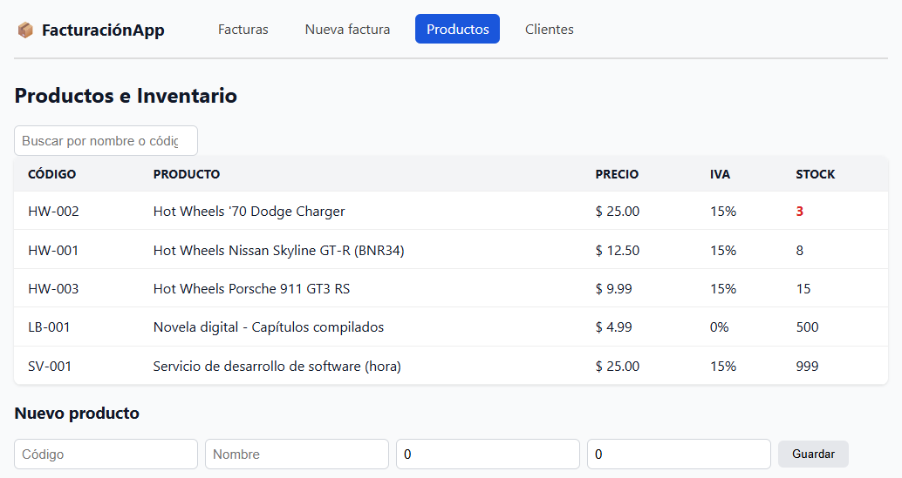
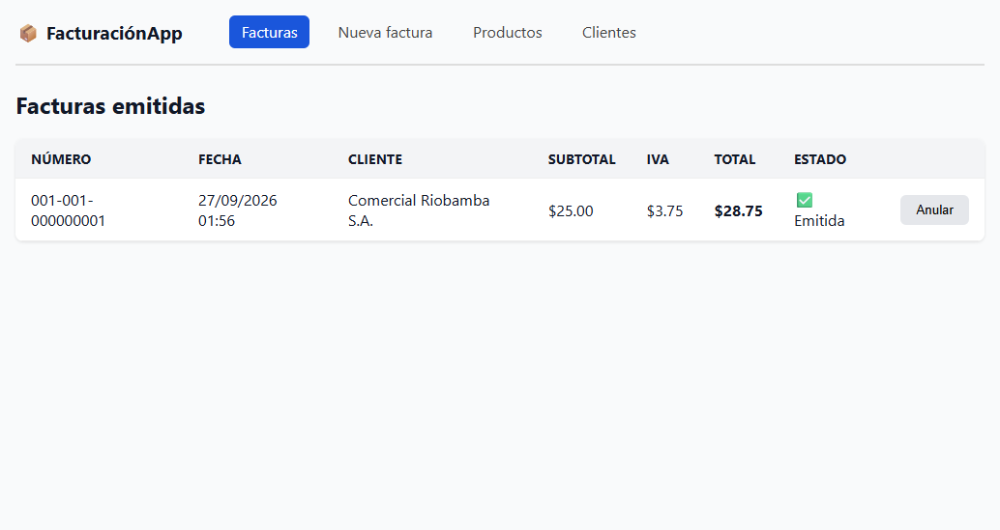

# 📦 FacturaciónApp

Sistema de **facturación e inventario para pymes** adaptado al contexto ecuatoriano
(RUC, cédula, consumidor final, IVA configurable). API REST en **.NET 10** con
frontend en **Angular 22**.

> Proyecto de portafolio — desarrollado en Riobamba, Ecuador 🇪🇨

## ✨ Funcionalidades

- **Productos e inventario:** CRUD completo con búsqueda, eliminación lógica y alerta de stock bajo
- **Clientes:** cédula, RUC, pasaporte o consumidor final, con identificación única
- **Facturación:** emisión con numeración secuencial formato Ecuador (`001-001-000000001`),
  cálculo de IVA por línea (15% por defecto, configurable por producto), descuento de stock
  transaccional y anulación con devolución de stock
- **Autenticación JWT con roles:** el vendedor puede facturar; solo el admin puede anular
  y eliminar productos. Contraseñas hasheadas con BCrypt
- **API REST documentada** con Swagger UI (con botón Authorize para probar con token)

## 🔑 Credenciales de demostración

| Rol | Email | Contraseña | Permisos |
|---|---|---|---|
| Admin | `admin@facturacion.app` | `admin123` | Todo + anular facturas + eliminar productos |
| Vendedor | `vendedor@facturacion.app` | `vendedor123` | Consultar y emitir facturas |
- **Base de datos con datos de demostración** al primer arranque

## 📸 Capturas

| Inventario | Facturas emitidas |
|---|---|
|  |  |

## 🛠️ Stack

| Capa | Tecnología |
|---|---|
| Backend | .NET 10, ASP.NET Core, EF Core 10, SQLite |
| Frontend | Angular 22 (standalone, signals, control flow `@if`/`@for`) |
| Docs API | Swagger / OpenAPI |
| Control de versiones | Git + GitHub |

## 🚀 Ejecutar en local

```bash
# 1. API (http://localhost:5059, Swagger en /swagger)
dotnet run --project Facturacion.Api

# 2. Frontend (http://localhost:4200)
cd facturacion-web
npm install
npx ng serve

# 3. Tests (8 pruebas de facturación y clave de acceso SRI)
dotnet test
```

La base de datos **se crea automáticamente con migraciones EF Core** (datos de
demostración incluidos) — no se requiere ningún setup adicional. Nuevas
migraciones: `dotnet ef migrations add <Nombre> --project Facturacion.Api`.

## 📡 Endpoints principales

| Método | Ruta | Descripción |
|---|---|---|
| GET/POST/PUT/DELETE | `/api/productos` | Gestión de productos |
| GET/POST | `/api/clientes` | Gestión de clientes |
| GET/POST | `/api/facturas` | Emisión y consulta de facturas |
| GET | `/api/facturas/{id}/pdf` | RIDE (PDF) de la factura |
| GET | `/api/facturas/{id}/xml` | XML esquema SRI v2.1.0 con clave de acceso de 49 dígitos (módulo 11) |
| POST | `/api/facturas/{id}/anular` | Anulación con devolución de stock |

## 🗺️ Roadmap

- [x] Autenticación JWT con roles (admin / vendedor) ✅
- [x] Factura en PDF (RIDE) con QuestPDF ✅
- [x] XML según esquema SRI v2.1.0 + clave de acceso módulo 11 ✅ *(ambiente pruebas; firma XAdES y autorización SRI pendientes)*
- [ ] Firma digital XAdES-BES y autorización con el SRI
- [x] Tests de la lógica de facturación (xUnit, 8 tests ✅)
- [x] EF Core Migrations + MigrateAsync ✅
- [ ] Dockerfile para la API
- [ ] GitHub Actions (CI: build + tests)
- [ ] Deploy público (Render + GitHub Pages)

## 📄 Licencia

MIT
